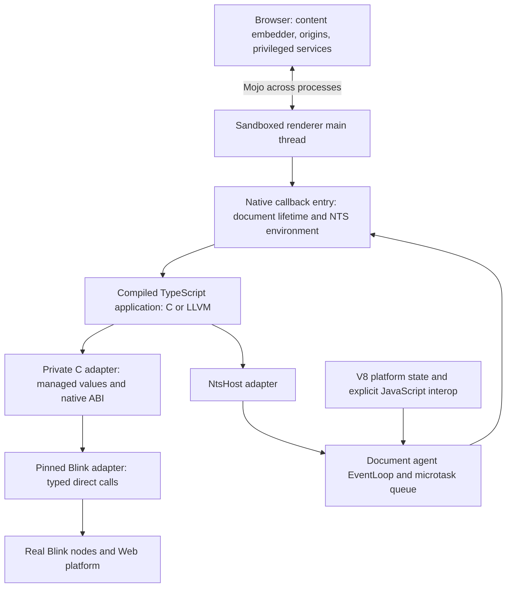

# Native Chromium architecture and cost experiments

Initial investigation, 2026-10-05. V8 remains enabled and React remains outside
scope. This complements the [RFC](../../../docs/electron-like.md) and the
[DOM/scheduling record](dom-and-microtasks.md); it is not a final API or ABI.
The objective covers execution, scheduling, ownership, binding generation,
interoperability, and deployment as well as individual DOM calls.

## Working architecture



Application DOM calls run on the renderer's owner thread. They call Blink in
the same process; neither JS evaluation, serialization, nor browser-process
IPC is required for an ordinary DOM mutation. Browser services still use
Chromium's process boundary. The C adapter owns managed NTS details; Blink
implementation types stay in its version-specific target. Static linking is
the current bring-up mechanism, not a commitment to a stable binary ABI.

Chromium supplies task scheduling and the message pump. V8 is not the event
loop host replacing libuv. Blink uses a V8 microtask queue for platform job
ordering, and native jobs join the document agent's actual queue. A second
renderer libuv loop would introduce another scheduler and lifecycle to
coordinate; the working renderer design uses the Chromium host.
Task/timer and cross-thread completion adapters are still unimplemented.
Web timer semantics would need Blink's scheduling rules, not just an arbitrary
delayed task. Native main-process/Node services remain a separate later scope.

V8 retains its realms, platform JavaScript callbacks, exception machinery,
and Blink GC integration. The app does not need a V8 object for every native
record or every native DOM handle. NTS records use RC and cycle collection;
Blink nodes use Oilpan, integrated with V8's C++ heap; JavaScript objects use
V8's collector. These facts do not supply a collector for NTS↔DOM↔JS cycles.
See the pinned [EventLoop](https://chromium.googlesource.com/chromium/src/+/b510e9d7cd3a2fbd78d0ddc42234103206c5f78d/third_party/blink/renderer/platform/scheduler/public/event_loop.h)
and [ThreadState](https://chromium.googlesource.com/chromium/src/+/b510e9d7cd3a2fbd78d0ddc42234103206c5f78d/third_party/blink/renderer/platform/heap/thread_state.cc).

## Architecture decisions to test

| Area | Current experiment | Candidate direction and acceptance gate |
| --- | --- | --- |
| Callback entry | Explicit per-document environment and C exception barrier | Keep ownership explicit. Compare per-operation realm setup with a lexical DOM entry; measure short callbacks and computation-only entries. |
| Synchronous semantics | Immediate Blink operations, individual CE reaction scopes, actual exception handling | Amortize entry setup without batching DOM effects or delaying reactions. Prove nested dispatch, foreign-realm reentry, and navigation during reactions. |
| Native object identity | Indexed handles with canonical lookup; every bound node remains rooted until disposal | Compare document-scoped root leases and typed foreign wrappers. Reclaim roots when the last native owner releases them; test stale identities and reuse before choosing a representation. |
| Cross-heap lifetime | Explicit listener removal and document disposal | Reduce cycles containing a DOM listener, an NTS closure, and a DOM reference. A weak cache alone cannot break arbitrary cycles. |
| Module state | Explicit state objects; no mutable application module globals | Compare explicit instance state, hidden instance parameters, and thread-local instance selection. A fresh environment does not instantiate generated module globals. Do not force extra renderers solely to hide this problem. |
| Jobs and tasks | Shared microtasks, owned run/drop envelopes, checkpoint-end collection witness | Agree generated cancellation and public checkpoint maintenance with the owning lanes. Then add owner-thread tasks/timers and cross-thread completions, with ordering and teardown tests. |
| Strings and primitives | Authored C ABI, typed-array loans, copied length-bearing UTF-16 | Investigate borrowed 8/16-bit string views and compact results without temporary managed buffers. Preserve NUL, lone surrogates, nullability and conversion semantics. |
| Binding generation | Handwritten implementation for a small IDL-derived subset | Generate typed direct operations and semantic annotations from pinned Chromium IDL/binding facts. Keep exceptional APIs behind reviewed adapters; reject unsupported operations explicitly. |
| V8 interop | V8 comparison instrumentation; no ordinary DOM call routed through JS | Make genuine JS-object/callback interop explicit. Measure wrapper creation, conversions and cross-heap retention separately. |
| Origin and packaging | Exact local-file opt-in | Move to browser-owned packaged origins and document-scoped services. Then test normal multi-document navigation, freeze/restore, startup and complete resources. |
| Optimization and upgrades | Debug component engine; native archive compiled with pinned Clang at `-O2` | Repeat with optimized Chromium, then investigate final static/LTO packaging. Preserve upstream layers and acceptance fixtures across a source-pin upgrade. |

The root lease and module-instance rows are proposals, not implemented
contracts. Raw Blink pointers cannot simply become reference-counted NTS
objects: Oilpan lifetime needs an explicit root bridge. A lease wrapper also
needs a disposal protocol and a cycle policy for callbacks that capture it.

Result/error representation is part of the architecture too. The prototype's
context-wide scratch status and subsequent `status()` read are convenient for
reductions; they are not a final reentrant exception ABI. Results should carry
their own success/error state, with full exception semantics defined before
general synchronous callbacks are admitted. Neither an arbitrary numeric
token nor a manual `Opaque` pointer establishes safe managed DOM ownership.

Generated bindings must account for conversions, overload resolution,
nullable results, `[CEReactions]`, execution/script context requirements,
`[ImplementedAs]`, exceptions and API-specific policies. Calling the same
method name is insufficient. Ordinary typed application syntax and the
generator follow a proven native representation; they do not require a new
Web HIR. The existing managed/opaque ABI refusal is recorded in the
[contract reductions](../contracts/README.md).

## Implemented experiment

`nts_blink_dom_native_scope` establishes the main-world script context and
do-not-run microtask scope once around a compiled DOM entry. Individual calls
retain document/realm validity checks, exception guards, node resolution,
strong context guards and their required CE reaction scopes. They skip repeat
realm/microtask setup only while the lexical entry's realm is actually current.
A reentrant call from another realm takes the ordinary setup path. No DOM
operation is deferred. General reentrant behavior is still an acceptance gate.

The existing DOM program, counter update and async completion DOM update now
exercise this scope. Their exact UTF-16, detached-node GC, error codes,
identity, input/lifecycle and complete mixed-job/CE/MO comparisons are checked
against independently executed V8 fixtures for both native backends.

The character copy now creates owned Blink UTF-16 storage directly and copies
the bytes once, avoiding the temporary vector and second copy. The former
vector path remains only as a benchmark control. This change preserves
embedded NUL and both paired and lone surrogates; it does not borrow native
storage after return or claim zero-copy DOM strings.

The initial benchmark setup exposed missing retention of borrowed string
parameters assigned to fields in the available compiler's generated code.
It now keeps source strings explicitly owned in C and passes them as borrowed
arguments. The returned setup record owns only freshly created typed arrays.
No generated output is rewritten and no missing retain is compensated for.
The compiler is the available October 3 binary recorded by `check.ts`, not a
new build of today's compiler sources.

## Entered DOM ABI (second iteration, 2026-10-05)

The debug results below were measured on a debug Blink *and* a debug V8, so
they cannot rank native against V8. They did show where the first bridge
spent its time: every operation looked up the main-world `ScriptState`,
entered the V8 context, opened a `MicrotasksScope` and a `v8::TryCatch`,
materialized a V8 `DOMException` to read back its code, and copied each
string after the compiled code had already converted it with a
`charCodeAt` loop. The second iteration removes each of those by design
rather than by tuning:

| Concern | First bridge | Entered ABI ([`dom_abi.h`](../dom/abi/dom_abi.h)) |
| --- | --- | --- |
| Entry | V8 context, microtask scope and `TryCatch` per operation | One `nts_blink_dom_entry` per native callback, holding the agent's microtask scope as `V8ScriptRunner::CallFunction` does for script; the outermost one checkpoints on return |
| Exceptions | Thrown into V8, caught, unwrapped to a code; non-DOM errors became 1000 | `DummyExceptionStateForTesting` records code and message with no isolate; each result carries its own status |
| Per-operation scopes | All of them | Only what the IDL member requires, e.g. `[CEReactions]` |
| Names, literal text | Copied and re-atomized on every call | Interned once per document; operations pass an atom id: no copy, no hash. A text write from the table is a shared `StringImpl` reference, which V8's externalization gives repeated page strings |
| Dynamic text | Copied twice and widened to UTF-16 | One copy at the string's own width (Latin-1 or UTF-16), the floor for text Blink keeps |
| Node handles | Index; every node rooted until disposal | Leased slot + generation; a released handle never aliases a later node, and the last lease unroots the node |
| Wrapper hop | `dom_host.c` per call | None: the Blink adapter implements the C ABI directly |

Two fixtures exercise it against ordinary page JavaScript in unmodified
`content_shell`. `binding-benchmark` keeps the Text-node microbenchmark and
adds Latin-1, fresh-string (`prefix + suffix` per mutation) and interned-text
rows. `rows-benchmark` is a js-framework-benchmark-shaped table
(create/replace/update/select/swap/remove/append/clear over 1k and 10k
rows, plus `+layout` cases that force style and layout after each
operation). Both fixtures run one case table; the runner requires the
native and V8 documents to end identical and the native registry to hold
exactly the leases the app still owns.

## Standalone evidence: the application's own cost

`benchmarks/standalone/check.ts` runs the same compiled rows app over a C
mini-DOM implementing `dom_abi.h`, and the V8 fixture's page script over a
JS mini-DOM in Node. C, LLVM and the page script build identical rows, and
the app leaks no lease. It found the largest cost outside Blink:

| One `remove` of 1,000 rows | C backend |
| --- | ---: |
| Runtime default: collect cycles at every checkpoint | 16.7 µs |
| Host-owned checkpoints, collection between interactions | 0.16 µs |
| That deferred collection, per removal | 0.23 µs |

The compiler retains and releases `app.rows` around the runtime `splice`
helper; the release leaves the array a cycle candidate, and the runtime's
checkpoint pass walks all of it on every event. The renderer host therefore
owns checkpoints and collects in Blink idle time
(`nts_chromium_probe_install_host`, `ThreadScheduler::PostIdleTask`), with
the runtime's candidate threshold as the backstop; the rows harness performs
and reports that collection between batches rather than hiding it. The
compiler-side cause and the runtime policy are recorded in
[compiler-requests.md](../contracts/compiler-requests.md), items 3 and 5, and
are being fixed in the compiler and runtime themselves. With collection out
of the way, the profile's hottest symbol is `fmod`: every `%` calls libm.

## Measurement method and interpretation

The script-free `binding-benchmark` fixture compares eight paths on the same
attached Text node, alternating distinct strings of 16, 256 and 4096 UTF-16
units. U+0100 forces wide representation in every path.

| Path | Purpose |
| --- | --- |
| `blink-prepared` | Intrinsic control using prebuilt Blink strings; omits adapter/conversion/binding work. |
| `native-vector-per-call` | Previous two-copy adapter control. |
| `native-copy-per-call` | Single-copy adapter with ordinary per-operation entry setup. |
| `native-copy-scoped` | Same operation inside a lexical DOM entry. |
| `compiled-copies-per-call`, `compiled-copies-scoped` | Actual compiled TS loop, freshly converting strings to typed arrays on every mutation. |
| `compiled-prepared-per-call`, `compiled-prepared-scoped` | Actual compiled TS loop reusing prepared native inputs. Blink still copies on every mutation. |

An additional entry matrix uses 0, 2, 8 or 32 mutations per compiled callback,
with and without a DOM entry scope. Every callback enters/leaves its native
environment normally; runtime checkpointing is not hidden inside a synthetic
outer callback. Zero mutations expose unnecessary realm setup. Nonempty
entries alternate A/B and finish on B, avoiding identical-value updates.

Each native launch collects 168 operation and 168 entry samples. Its separate
ordinary page-JavaScript reference collects 21 samples in unmodified
`content_shell`, with normal V8 JIT. Six launch pairs per backend balance both
launch orders and all three payload-length rotations, giving 42 samples per
case. Warm-up uses 16,384 operations and calibration targets 16 ms samples,
followed by seven rounds. Timing happens in the renderer;
CDP, setup and logging stay outside the repeated timed work. Samples include
allocation/retain counters and entry validation; they are diagnostic cost
comparisons, not uninstrumented API latency. Setup allocations are reclaimed
and checked against the pre-setup native live count. Prepared loops must
allocate no NTS heap objects and all loops must preserve native live counts.

The runner pins only the measured renderer main thread when `--cpu` is given,
verifies its PID/executable and sandbox, and records CPU information, affinity,
host load, raw samples, quartiles, source/archive/compiler identities and GN
arguments. It rejects an active build or changed executable/staging/arguments.
The V8 control uses the same Text-node mutation and payloads in its own
document, with matching Chromium configuration, display, main-thread CPU
affinity and sandbox. Application code is loaded by the HTML parser and
invoked through real input; debugger evaluation only inspects state. Spare
renderer prewarming is suppressed equally to make the measured tab's PID
unambiguous. Native TimeTicks and page performance.now differ in precision;
long samples reduce page-clock quantization. No forced GC occurs inside
measured loops. The current NTS runtime's allocation counters remain part of
native execution; no extra per-call counters are added to the V8 path.
This is not an end-to-end layout, rendering, memory or cold-start workload.
The short native entry matrix is not a V8 callback-latency comparison.
Full Chrome's product services, PGO and final distribution settings are also
outside this component-engine comparison.

The debug diagnostic establishes three NTS heap allocations per fresh input
conversion and zero for prepared input through both backends. Prepared input
still incurs one managed retain per mutation and a Blink string allocation;
zero NTS allocations does not mean zero total allocations or zero overhead.
The short-callback axis shows why a realm scope should not be applied blindly
to all native code: it adds work to a computation-only entry. The optimized
engine must establish the production break-even point and cost ranking.

## Optimized engine results (2026-10-05)

Static release Chromium with DCHECKs off (`perf-args.gn`), C backend, the
entered DOM ABI. The archive was compiled by the candidate compiler pin
`chromium-rc/pins/dev-665bfe681be4` (SHA `7ef4e76c...`, main 7a453f3ad plus
the three RC packets below): the shipped `target/release/nts` leaks the rows
app's table when it is destroyed (an export's parameter fields were assumed
zero), so the rows workload cannot pass its own leak checks with it. Each
result records the compiler it used. V8 is unmodified `content_shell` with
normal JIT. Semantic smoke and V8-oracle checks pass on this engine.

Text-node mutation, median ns per mutation, six balanced launch pairs:

| Payload | Interned (atom) | Prepared | Fresh `string` | V8 fresh | V8 repeated | Blink intrinsic |
| --- | ---: | ---: | ---: | ---: | ---: | ---: |
| Latin-1, 16 | 56 | 112 | 133 | 129 | 75 | 47 |
| Latin-1, 256 | 56 | 112 | 158 | 259 | 92 | 46 |
| Latin-1, 4096 | 56 | 138 | 1834 | 1393 | 1307 | 47 |
| UTF-16, 256 | 57 | 121 | 743 | 320 | 87 | 47 |
| UTF-16, 4096 | 57 | 168 | 9188 | 2453 | 2468 | 47 |

The boundary itself is about 9 ns: an interned write costs 56 ns against 47 ns
for Blink's own call with a prebuilt string. Everything above that is strings.
Fresh text crosses today's `string` ABI as UTF-8 -- copied by NTS, scanned,
then scanned and copied again by Blink -- and non-ASCII text is three to four
times slower than V8 because of it ([request 1](../contracts/compiler-requests.md)).
A native entry costs 32 ns; inside one, an operation is about 117 ns against
about 152 ns with per-operation setup.

The rows workload (js-framework-benchmark-shaped, four balanced pairs) is at
parity: create1k 2.82 vs 2.90 ms, replace1k 3.30 vs 3.30 ms, update10th 20.2 vs
20.0 us, create10k 27.8 vs 28.4 ms. Blink's cloning, insertion and text work
dominate; the compiled application's own cost (about 0.9 ms per thousand rows
standalone) is a small slice. `create1k+layout` was the exception (38.2 ms
native against 30.2 ms V8); [the next section](#the-layout-gap-was-gc-pacing)
explains it, and it was the harness.

What this says about where native wins: per-call binding work (interned and
prepared text, 2-40x), and compute in the application itself -- not DOM
construction, where both engines wait on Blink.

## String views (2026-10-05)

`StringView` (main ccfe38f51, request 1) replaced the UTF-8 crossing on every
text parameter of both ABIs. The program passes its string itself; the
adapter reads it with `nts_string_view` and copies the units once, at their
own width, into a Blink string of the same width (`CopyView`). A literal
(immortal) is copied once per document and shared after, keyed by its
address (`NtsDomContext::Text`). `NtsDomString` and the `units()`
`Uint16Array` conversion are gone; Blink's text comes back as a view too.
The smoke's exact-units witness -- NUL, Latin-1, a lone high and low
surrogate, a pair -- now passes through `string` itself.

Same engine profile, `--cpu 4`, median ns per mutation, before -> after (the
controls drifted about 4% slower between the two runs):

| Payload | `string` | Fresh `string` | Prepared UTF-16 | V8 fresh |
| --- | ---: | ---: | ---: | ---: |
| Latin-1, 256 | 145 -> 117 | 158 -> 137 | 115 -> 125 | 266 |
| Latin-1, 4096 | 557 -> 145 | 1834 -> 1491 | 170 -> 177 | 1416 |
| UTF-16, 16 | 279 -> 117 | 295 -> 135 | 113 -> 119 | 151 |
| UTF-16, 256 | 718 -> 124 | 743 -> 146 | 121 -> 126 | 329 |
| UTF-16, 4096 | 6707 -> 170 | 9188 -> 2757 | 168 -> 177 | 2426 |

A `string` now costs what a prepared buffer does, with zero NTS allocations
(asserted by `benchmark.ts`). What remains in the fresh rows is building the
string -- a 4096-unit concatenation per mutation -- where V8 is still 5-14%
ahead at 4096 units and behind at every shorter length. Rows are unchanged
(their text is ASCII, which UTF-8 already lent in place): create1k 2.78 vs
3.20 ms, update10th 17.9 vs 20.0 us, create1k+layout still 38.1 vs 29.7 ms.
Evidence: `target/chromium/perf/{binding-benchmark,rows}-c-sv/`.

## The layout gap was GC pacing

`create1k+layout` cost 38.1 ms native against 29.1 ms V8 although both build
the identical DOM -- `benchmark.ts` now asserts the whole subtree's markup
and node counts equal, not only each row's text. Timed alone, the forced
layout was the whole difference (34.3 vs 26.4 ms). A Chromium trace
(`benchmark.ts --trace`) showed why: native ran 30 major GC cycles to V8's
62, but each one in ~459 incremental Oilpan marking steps against ~22, so a
marking cycle was open during most native layouts -- allocation-driven
marking steps and write barriers inside layout. V8 paces incremental marking
by JS-heap allocation, which page script supplies in quantity; the compiled
app allocates in its own heap, which V8 does not see, so a cycle advanced
only by Oilpan's own small steps. Both harnesses ran every round in one
task, so Blink's scheduled GC work never ran between them. Confirmed with
`--diagnostic-js-flags --no-incremental-marking` on both engines: 30.6 vs
30.6 ms, layout 27.9 vs 27.6.

A real application is not one long task: each interaction is its own task
and a frame renders between them. Both harnesses now run each round as the
setup task, a rendered frame (`requestAnimationFrame`; Blink's internal
`FrameCallback`), then the timed task. Every case became unimodal -- before,
`remove` was 0.8 or 4 us depending on whether a frame happened to fall
between setup and batch -- and the engines run the same number of GC cycles
(92 vs 92-94). Two runs, `--cpu 4`, native/V8 ms:

| Case | Native | V8 | Ratio |
| --- | ---: | ---: | ---: |
| create1k | 2.83 | 2.90 | 0.98 |
| replace1k | 5.71 | 5.70 | 1.00 |
| create10k | 24.2 | 26.4 | 0.92 |
| clear10k | 34.2 | 34.1 | 1.00 |
| create1k+layout | 28.6-30.4 | 28.3-28.7 | 1.01-1.06 |
| update10th+layout | 5.91-6.35 | 5.68-5.82 | 1.04-1.09 |

What remains is structural, not a defect: native still advances marking in
about 2.5x as many smaller steps (Oilpan's allocation-driven steps against
V8's), worth a few percent of layout-heavy frames. A native host that
allocates outside V8's heap does not feed V8's marking pace; any lever for
that belongs to Blink/V8's embedder API, not to the compiled program.

The run also found the renderer harness leaking its own `tbody` query lease
(the app borrows it; nobody released it); both harnesses now release it and
assert zero leases after destroy. Evidence: `target/chromium/perf/
rows-c-{layout,trace,noincremental,frames,frames-trace}/`.

## Binding kernels from native-typescript

native-typescript (`~/Projects/native-typescript`, ScriptC) measured
create-element and detached-counter-tree at 0.56-0.92x V8. The same two
kernels now run here (`--workload kernels`, `src/kernels.ts`,
`kernels_benchmark.cc`, `kernels-benchmark-v8` with its `v8.js` kernels
unchanged), in three lanes of one build: Blink C++ written as its host
wrote it, the compiled program, and page JavaScript. 20,000 iterations per
sample, one posted task per sample, `--cpu 4`, median ns per operation:

| Kernel | Shape | C++ | Compiled | V8 | /C++ | /V8 | ScriptC /V8 |
| --- | --- | ---: | ---: | ---: | ---: | ---: | ---: |
| create-element | loop | 55.6 | 81.9 | 115 | 1.47 | 0.71 | 0.635 |
| create-element | per-call | 48.4 | 133.1 | 140 | 2.75 | 0.95 | 0.560 |
| detached-counter-tree | loop | 329.1 | 262.4 | 305 | 0.80 | 0.86 | 0.868 |
| detached-counter-tree | per-call | 323.5 | 356.8 | 300 | 1.10 | 1.19 | 0.920 |

Why either native lane beats V8 here and not in the rows workload: these
kernels are almost all binding. V8 creates a JS wrapper for every node
`createElement` returns and checks every argument; the native lanes create
none. In rows, Blink's cloning, insertion and layout dominate and both
engines wait on Blink.

Where this ABI differs from ScriptC's, by the numbers:

- **A lease per returned node: about 26 ns.** create-element is 82 ns against
  ScriptC's 62 over the same ~55 ns floor. ScriptC passed a node the compiler
  proved frame-bounded as the raw Blink pointer (Oilpan finds it by stack
  scan) and registered only escaping ones; here every handle goes through
  the traced registry and is released by hand. The counter tree pays it
  twice. That is the case for frame-bounded handles in the compiler
  (request 2).
- **Literal text is shared, not built.** The counter tree beats the C++
  floor (262 against 329 ns): the C++ lane, as written, builds
  `AtomicString("button")` and two Strings from literals every iteration,
  while the compiled lane passes an interned tag and literal views that the
  adapter copies once per document. (Inferred from the code; no lane yet
  isolates it.)
- **Per-call pays a native entry.** ScriptC's per-call called the compiled
  function directly with the realm set once; here each call is a native
  callback -- environment entry, microtask and handle scopes, and the
  kernel's own interning -- about 50-95 ns. That is what an event handler
  costs here, but it is not what ScriptC's per-call measured.

Evidence: `target/chromium/perf/kernels-c/`.

## Nodes as pointers: DOM ABI v3 (2026-10-06)

The lease table is gone (design in [architecture.md](architecture.md),
section 3). A node is its `blink::Node *`; the program's nodes are typed
`HostClass` handles, rooted by the compiler only where they leave the stack,
through one `HeapHashCountedSet` per thread. Names are literal `StringView`s
cached as `AtomicString`s by address; text comes back as a `StringView`
result. The legacy bridge (per-call scopes, context-wide status, UTF-16
copies) is retired; the binding benchmark keeps its entered rows and the
prepared-buffer controls. Compiler work it took, all on main: 1bd750e5e
(`HostClass`), f03831fd4 (`StringView` results), 6c08170ef (stack returns,
null at a branch), 6d2fd2542 (`program.h` says what an export takes over --
the gap the strict mini-DOM found when a C caller lent a node an export
kept).

Kernels, `--cpu 4`, median ns per operation, leases -> pointers:

| Kernel | Shape | C++ | Compiled | V8 | /V8 | ScriptC /V8 |
| --- | --- | ---: | ---: | ---: | ---: | ---: |
| create-element | loop | 54.6 | 81.9 -> 54.0 | 100 | 0.71 -> 0.54 | 0.635 |
| create-element | per-call | 47.9 | 133.1 -> 74.5 | 100 | 0.95 -> 0.75 | 0.560 |
| detached-counter-tree | loop | 241.4 | 262.4 -> 199.3 | 285 | 0.86 -> 0.70 | 0.868 |
| detached-counter-tree | per-call | 260.9 | 356.8 -> 319.2 | 290 | 1.19 -> 1.10 | 0.920 |

The loop shapes are at the C++ floor or under it (literal names and text are
made once per document; the C++ lane builds them per call). What per-call
still pays is the native entry per call -- environment, microtask and handle
scopes -- which ScriptC's per-call never did; an event handler pays it once.

Rows (one task per round, a frame between setup and measurement) stay at
parity: create1k 1.02, replace1k 0.98, create10k 0.89, clear10k 1.05,
create1k+layout 1.01, update10th+layout 1.03. The text paths of the binding
benchmark are unchanged against their controls (a `string` costs what a
prepared buffer does; interned text 58 ns against Blink's own 50).

Correctness: the DOM witness (identity by address, every exception code,
exact text both ways, and a detached node surviving a forced conservative
collection with only the stack referring to it -- its precise-GC control
arm crashes); C, LLVM and V8 build the same rows standalone and in the
browser; roots 2 + 2 x rows while the app lives and 0 after destroy, in
both harnesses. Evidence: `target/chromium/perf/{kernels,rows,binding}-c-v3/`,
`v3-native-dom-c-smoke`, `v3-control-dom-smoke`.

## Events: native listeners (2026-10-06)

Compiled closures listen on Blink targets (design in architecture.md section
5). The DOM witness clicks a button twice through a compiled listener that
writes the label, removes it, clicks again with no effect, and ends with no
root held -- giving the closure back released the nodes it captured. The
kernels gain native-typescript's synchronous-event-round-trip, `--cpu 4`:

| Shape | C++ native listener | Compiled | V8 | /V8 | ScriptC /V8 |
| --- | ---: | ---: | ---: | ---: | ---: |
| loop (one listener, 20,000 clicks) | 557 | 536 | 795 | 0.67 | 1.07 |
| per-call (listen, click, remove) | 624 | 873 | 1080 | 0.81 | 0.64 |

Per-call allocates the closure and its state per listen and pays an entry;
ScriptC's per-call did neither. Evidence: `target/chromium/perf/
kernels-c-events/`, `events-dom-c-smoke`.

Sanitizers: the standalone rows path built from source with ASan and UBSan
(`-fsanitize=address,undefined -fno-sanitize-recover=undefined`; the
program, the runtime, the mini-DOM and the driver) runs both collection
policies clean -- no memory error, no undefined behaviour, and no leak once
the mini-DOM's deliberately never-freed nodes are suppressed -- and ends at
999 rows, 2000 roots while the app lives, 0 after destroy.

## Generated bindings, an application, and a profile (2026-10-06)

Optimized perf engine, now with symbols (`symbol_level = 1`, no code change).
Renderer pinned to CPU 4, a P-core of an i9-14900K. CPUs 16 to 31 are
E-cores, a different microarchitecture: never compare runs across them. The
machine was shared with four to five peer compiles, so absolute numbers
move between sessions. Ratios within one run do not, and are what is
reported.

**Kernels on the generated bindings**: compiled over Blink's own C++, and
over V8, in one run (`perf/kernels-c-noraw`, 6 runs):

| kernel | shape | compiled/C++ | compiled/V8 | hand-written ABI, compiled/C++ |
|---|---|---|---|---|
| create-element | loop | 0.98 | 0.50 | 0.99 |
| create-element | per call | 1.61 | 0.66 | 1.36 |
| counter tree | loop | 0.75 | 0.51 | 0.74 |
| counter tree | per call | 0.97 | 0.70 | 1.24 |
| event round trip | loop | 0.85 | 0.43 | 0.96 |
| event round trip | per call | 0.97 | 0.51 | 1.40 |

So Blink-exact semantics through generated code cost nothing over the
hand-written ABI they replaced. That holds only after one fix the
symbolized profile found. `raw_ptr` is BackupRefPtr on pointers into
PartitionAlloc memory, which includes the program's heap because malloc is
shimmed, so each one made and dropped is an atomic count. The generated
call's stack-only helpers made three or more per call. They are
`STACK_ALLOCATED` and now hold plain pointers. Before the fix, compiled/C++
was 1.18 (create-element), 0.93 (counter tree) and 1.07 (event round trip).
The per-call shape still pays the entry (~24 ns: the environment, the
`HandleScope`, the `MicrotasksScope` and the active-document check). The
rest of the main thread's profile is Blink's own: event dispatch, garbage-
collected allocation, write barriers.

**TodoMVC** (`perf/todo-c`, 6 runs, 58 real input interactions each):

| event the app handles | compiled | V8 | compiled/V8 |
|---|---|---|---|
| `change` (add, toggle) | 55 us | 115 us | 0.48 |
| `click` (destroy, filter, clear) | 65 us | 130 us | 0.50 |
| `keydown` (no listener: control) | 9.6 us | 10.7 us | 0.90 |
| `input` (no listener: control) | 2.2 us | 2.3 us | 0.93 |

These are mean `EventDispatch` slices from the trace: listeners plus
default handling. The two events the app does not listen to stay near
parity, which shows the slices measure the listeners. End to end, each
interaction waits for its frame in both engines (~880 to 905 ms per run),
so at human pace both are frame-bound, and the compiled app leaves half the
frame's script budget unused.

**Rows** (`perf/rows-c-generated`, 6 runs) are preliminary. Ratios ranged
from 0.72 (create10k) to 1.45 (swap+layout). The swap case is
layout-dominated, and its layout time alone differed between engines
(1.9 against 1.3 ms) on identical DOMs, which only noise explains. What
held every run: both engines build identical DOMs (asserted), two roots per
row, and 4662 program allocations per create1k, as before. A quiet-machine
rerun is owed.

**Correctness in the browser.** The DOM witness passes on C and LLVM.
compare.ts has C and LLVM, DOM and microtasks, each agreeing with the
independently run V8 oracle, including the 82-line differential transcript
of `tests/idl-vectors.ts`. That transcript covers values, node shapes,
token lists at each variadic arity, an inline style and its layout read
back, and every exception's name and Blink's message.

Three compiler defects surfaced here, each reported with a reduction:

- `===` across related handle types is invalid C (section 7).
- A handle-returning closure called as `() => void` aborts at run time
  (blocker `a-handle-returning-closure-called-as-void`).
- A narrowed accessor read loses its null check, a SEGV (section 9).

All three are fixed or scheduled by the compiler lane.

## RC defects found by this lane and fixed in the compiler

Measured with `tooling/memory`'s harness on the unmodified compiler (main
7a453f3ad), each fixed on branch `chromium/rc-runtime-helper-borrows`
(worktree `~/.cache/nts-chromium-rc`), and landed on main as 7c1ea2099,
bdd57aa29, ee5b38823 and a2fe27266 (event-state bench f72fa7563):

| Defect | Effect on main | Commit |
| --- | --- | --- |
| A field of a parameter retained around runtime array helpers (`app.rows.splice`) | every event re-walked the whole table at the checkpoint: remove 30.2 -> 0.10 us | a26a73f62 |
| Cycle classification ignored structural casts, erased fields, Map/Set/Promise | cycles leaked (15, 5 and 15 objects in three reductions) | edbded1db |
| An export's parameter fields assumed zero ("no caller to be wrong about") | `app.rows = []` in an export leaked the old array and its rows | 665bfe681 |

The second also made the first safe: eliding the container's retain unmasked
a misclassified cycle (0 -> 15 leaked) until classification was honest.

## Completed debug measurements

Both six-pair runs passed on 2026-10-05. The following values are medians in
microseconds per mutation, with 42 samples per cell. The two V8 rows are
separate cohorts of the same unmodified executable, not different V8 backends.
These replace the earlier debugger-evaluated, unbalanced comparisons.

| Path / cohort | 16 UTF-16 units | 4096 UTF-16 units |
| --- | ---: | ---: |
| C compiled, fresh conversion, scoped | 4.627 | 13.177 |
| LLVM compiled, fresh conversion, scoped | 4.585 | 16.237 |
| C compiled, prepared, per-call setup | 4.764 | 5.072 |
| LLVM compiled, prepared, per-call setup | 4.744 | 5.007 |
| C compiled, prepared, scoped | 4.249 | 4.456 |
| LLVM compiled, prepared, scoped | 4.146 | 4.425 |
| Intrinsic prebuilt Blink, C cohort | 2.016 | 2.036 |
| Intrinsic prebuilt Blink, LLVM cohort | 2.033 | 2.023 |
| Ordinary page V8, C cohort | 3.237 | 6.277 |
| Ordinary page V8, LLVM cohort | 2.673 | 2.665 |

Prepared compiled loops perform zero NTS heap allocations and one retain per
mutation in both backends; fresh conversions perform three allocations and
one retain. Single-copy plus lexical setup removes costs from the old vector
control, which measured 74.130 µs (C cohort) and 72.396 µs (LLVM cohort) at
4096 units. These are debug implementation costs, not expected production
ratios. Individual checks and the Blink allocation still remain in the new
prepared path; its approximately 4.2–4.5 µs cost exceeds the intrinsic control.

V8 has substantial unexplained between-launch variation. At 4096 units, some
launches stay around 2.6 µs and others around 6.1–6.7 µs through the timed
rounds. The LLVM-cohort V8 interquartile interval is 2.632–6.177 µs, versus
4.314–4.478 µs for its prepared scoped native path. The C-cohort V8 interval
is 6.056–6.516 µs, versus 4.410–4.653 µs for native. Slow launches are retained
in the raw samples. Warm-up/tiering and string externalization are possible
investigation leads, not established explanations. Fixed operation-count
warm-up does not prove that V8 has reached steady state. The reversal between
cohorts prevents a robust native-versus-V8 performance conclusion. In the
stable short-string rows, ordinary V8 is faster than this native prototype.

The separate entry matrix also exposes an architectural tradeoff. The table
below is microseconds **per callback**, with 16-unit prepared inputs and normal
NTS entry/leave maintenance in every callback:

| DOM mutations / callback | C per-call setup | C lexical scope | LLVM per-call setup | LLVM lexical scope |
| --- | ---: | ---: | ---: | ---: |
| 0 | 0.385 | 1.522 | 0.386 | 1.535 |
| 2 | 10.004 | 10.325 | 10.001 | 10.305 |
| 8 | 38.646 | 35.677 | 38.317 | 35.122 |
| 32 | 156.000 | 138.148 | 151.600 | 134.504 |

Scope setup loses on empty/two-operation entries and wins in the sampled
eight/32-operation entries. That is evidence for selective entry architecture,
not a production break-even threshold. Optimized Blink and stable V8 cohorts
are still required before selecting a final binding design.

Raw results, including provenance and all samples, are in
`target/chromium/binding-benchmark-{c,llvm}-debug/result.json`. The selected
baseline executable at handoff uses C. No optimized engine build is running;
see the [handoff](handoff.md) for the exact stop state and continuation steps.

## Reproduce and next gates

After the accepted baseline, run each backend sequentially:

```sh
node tooling/chromium/probe.ts c
node tooling/chromium/chromium.ts build --jobs 8
node tooling/chromium/benchmark.ts third_party/chromium/src/out/NtsBaseline/nts_shell target/chromium/binding-benchmark-c-debug c --allow-debug --cpu 4 --runs 6
node tooling/chromium/probe.ts llvm
node tooling/chromium/chromium.ts build --jobs 8
node tooling/chromium/benchmark.ts third_party/chromium/src/out/NtsBaseline/nts_shell target/chromium/binding-benchmark-llvm-debug llvm --allow-debug --cpu 4 --runs 6
```

Use an available CPU on the measurement host. Debug engine timings require
explicit `--allow-debug` and cannot establish production performance.

The optimized profile is a static release build with DCHECKs off
(`perf-args.gn`): non-official Linux builds otherwise default
`dcheck_always_on` and expensive DCHECKs on, and a component build puts
every adapter->Blink->V8 call behind a PLT. It is still not an official
ThinLTO/PGO build. Its first build started 2026-10-05:

```sh
node tooling/chromium/probe.ts c --profile perf
node tooling/chromium/chromium.ts build --profile perf --jobs 8 --background
node tooling/chromium/chromium.ts status --profile perf
# After the build passes, run semantic checks before performance comparison.
node tooling/chromium/smoke.ts third_party/chromium/src/out/NtsPerf/nts_shell target/chromium/perf/native-dom-c-smoke c dom
node tooling/chromium/smoke.ts third_party/chromium/src/out/NtsPerf/nts_shell target/chromium/perf/native-microtasks-c-smoke c microtasks
node tooling/chromium/benchmark.ts third_party/chromium/src/out/NtsPerf/nts_shell target/chromium/perf/binding-benchmark-c c --cpu 4 --runs 6
node tooling/chromium/benchmark.ts third_party/chromium/src/out/NtsPerf/nts_shell target/chromium/perf/rows-c c --cpu 4 --runs 4 --workload rows
```

Repeat with LLVM after the C run. All profiles share a writer guard because
their staged source is shared; never stage or build another profile while a
build runs. Eight jobs remain the conservative limit after the earlier OOM.
Add `--collection checkpoint` to the rows run for the runtime-default arm.

Next measure the entry break-even point and native/Blink boundary with the
optimized engine, then investigate borrowed string views and root leases.
In parallel with those architecture choices, reduce reentry/disposal,
module-instance and cancellation semantics before widening the binding surface.
Finally use equivalent complete UI workloads for cold/warm startup, event-to-
paint latency, CPU, allocation, PSS and distribution resources. Promote choices
only when both semantics and the relevant measurements support them.
