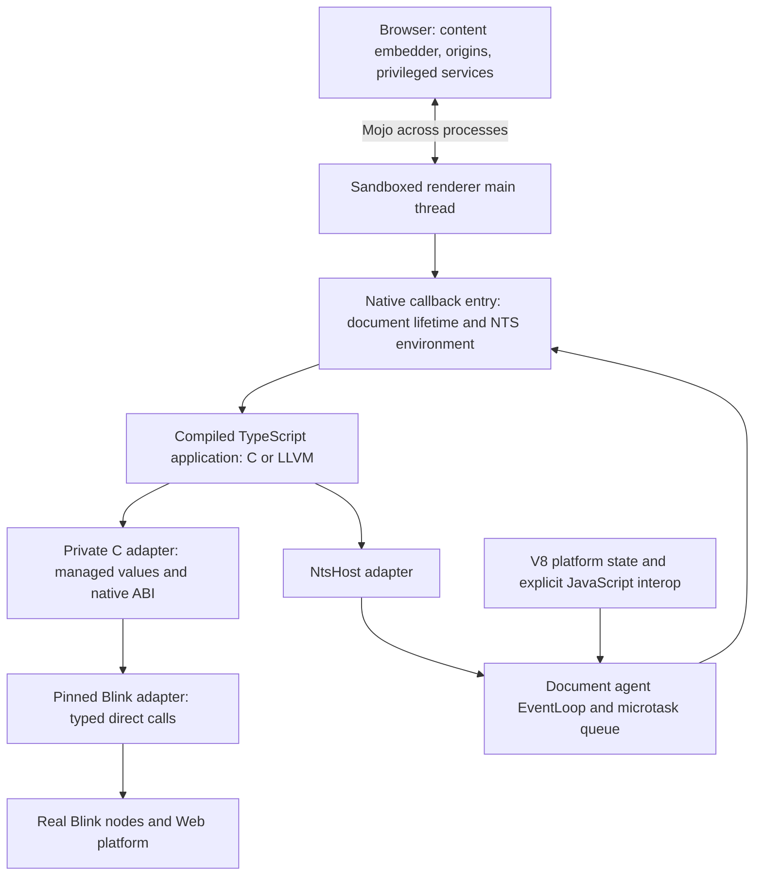

# Native Chromium architecture and cost experiments

Initial investigation, 2026-10-05. V8 remains enabled and React remains outside
scope. This complements the [RFC](../../../docs/electron-like.md) and the
[DOM/scheduling record](dom-and-microtasks.md); it is not a final API or ABI.
The objective covers execution, scheduling, ownership, binding generation,
interoperability, and deployment as well as individual DOM calls.

## Working architecture



Application DOM calls run on the renderer's owner thread. They call Blink in
the same process; neither JS evaluation, serialization, nor browser-process
IPC is required for an ordinary DOM mutation. Browser services still use
Chromium's process boundary. The C adapter owns managed NTS details; Blink
implementation types stay in its version-specific target. Static linking is
the current bring-up mechanism, not a commitment to a stable binary ABI.

Chromium supplies task scheduling and the message pump. V8 is not the event
loop host replacing libuv. Blink uses a V8 microtask queue for platform job
ordering, and native jobs join the document agent's actual queue. A second
renderer libuv loop would introduce another scheduler and lifecycle to
coordinate; the working renderer design uses the Chromium host.
Task/timer and cross-thread completion adapters are still unimplemented.
Web timer semantics would need Blink's scheduling rules, not just an arbitrary
delayed task. Native main-process/Node services remain a separate later scope.

V8 retains its realms, platform JavaScript callbacks, exception machinery,
and Blink GC integration. The app does not need a V8 object for every native
record or every native DOM handle. NTS records use RC and cycle collection;
Blink nodes use Oilpan, integrated with V8's C++ heap; JavaScript objects use
V8's collector. These facts do not supply a collector for NTS↔DOM↔JS cycles.
See the pinned [EventLoop](https://chromium.googlesource.com/chromium/src/+/b510e9d7cd3a2fbd78d0ddc42234103206c5f78d/third_party/blink/renderer/platform/scheduler/public/event_loop.h)
and [ThreadState](https://chromium.googlesource.com/chromium/src/+/b510e9d7cd3a2fbd78d0ddc42234103206c5f78d/third_party/blink/renderer/platform/heap/thread_state.cc).

## Architecture decisions to test

| Area | Current experiment | Candidate direction and acceptance gate |
| --- | --- | --- |
| Callback entry | Explicit per-document environment and C exception barrier | Keep ownership explicit. Compare per-operation realm setup with a lexical DOM entry; measure short callbacks and computation-only entries. |
| Synchronous semantics | Immediate Blink operations, individual CE reaction scopes, actual exception handling | Amortize entry setup without batching DOM effects or delaying reactions. Prove nested dispatch, foreign-realm reentry, and navigation during reactions. |
| Native object identity | Indexed handles with canonical lookup; every bound node remains rooted until disposal | Compare document-scoped root leases and typed foreign wrappers. Reclaim roots when the last native owner releases them; test stale identities and reuse before choosing a representation. |
| Cross-heap lifetime | Explicit listener removal and document disposal | Reduce cycles containing a DOM listener, an NTS closure, and a DOM reference. A weak cache alone cannot break arbitrary cycles. |
| Module state | Explicit state objects; no mutable application module globals | Compare explicit instance state, hidden instance parameters, and thread-local instance selection. A fresh environment does not instantiate generated module globals. Do not force extra renderers solely to hide this problem. |
| Jobs and tasks | Shared microtasks, owned run/drop envelopes, checkpoint-end collection witness | Agree generated cancellation and public checkpoint maintenance with the owning lanes. Then add owner-thread tasks/timers and cross-thread completions, with ordering and teardown tests. |
| Strings and primitives | Authored C ABI, typed-array loans, copied length-bearing UTF-16 | Investigate borrowed 8/16-bit string views and compact results without temporary managed buffers. Preserve NUL, lone surrogates, nullability and conversion semantics. |
| Binding generation | Handwritten implementation for a small IDL-derived subset | Generate typed direct operations and semantic annotations from pinned Chromium IDL/binding facts. Keep exceptional APIs behind reviewed adapters; reject unsupported operations explicitly. |
| V8 interop | V8 comparison instrumentation; no ordinary DOM call routed through JS | Make genuine JS-object/callback interop explicit. Measure wrapper creation, conversions and cross-heap retention separately. |
| Origin and packaging | Exact local-file opt-in | Move to browser-owned packaged origins and document-scoped services. Then test normal multi-document navigation, freeze/restore, startup and complete resources. |
| Optimization and upgrades | Debug component engine; native archive compiled with pinned Clang at `-O2` | Repeat with optimized Chromium, then investigate final static/LTO packaging. Preserve upstream layers and acceptance fixtures across a source-pin upgrade. |

The root lease and module-instance rows are proposals, not implemented
contracts. Raw Blink pointers cannot simply become reference-counted NTS
objects: Oilpan lifetime needs an explicit root bridge. A lease wrapper also
needs a disposal protocol and a cycle policy for callbacks that capture it.

Result/error representation is part of the architecture too. The prototype's
context-wide scratch status and subsequent `status()` read are convenient for
reductions; they are not a final reentrant exception ABI. Results should carry
their own success/error state, with full exception semantics defined before
general synchronous callbacks are admitted. Neither an arbitrary numeric
token nor a manual `Opaque` pointer establishes safe managed DOM ownership.

Generated bindings must account for conversions, overload resolution,
nullable results, `[CEReactions]`, execution/script context requirements,
`[ImplementedAs]`, exceptions and API-specific policies. Calling the same
method name is insufficient. Ordinary typed application syntax and the
generator follow a proven native representation; they do not require a new
Web HIR. The existing managed/opaque ABI refusal is recorded in the
[contract reductions](contracts/README.md).

## Implemented experiment

`nts_blink_dom_native_scope` establishes the main-world script context and
do-not-run microtask scope once around a compiled DOM entry. Individual calls
retain document/realm validity checks, exception guards, node resolution,
strong context guards and their required CE reaction scopes. They skip repeat
realm/microtask setup only while the lexical entry's realm is actually current.
A reentrant call from another realm takes the ordinary setup path. No DOM
operation is deferred. General reentrant behavior is still an acceptance gate.

The existing DOM program, counter update and async completion DOM update now
exercise this scope. Their exact UTF-16, detached-node GC, error codes,
identity, input/lifecycle and complete mixed-job/CE/MO comparisons are checked
against independently executed V8 fixtures for both native backends.

The character copy now creates owned Blink UTF-16 storage directly and copies
the bytes once, avoiding the temporary vector and second copy. The former
vector path remains only as a benchmark control. This change preserves
embedded NUL and both paired and lone surrogates; it does not borrow native
storage after return or claim zero-copy DOM strings.

The initial benchmark setup exposed missing retention of borrowed string
parameters assigned to fields in the available compiler's generated code.
It now keeps source strings explicitly owned in C and passes them as borrowed
arguments. The returned setup record owns only freshly created typed arrays.
No generated output is rewritten and no missing retain is compensated for.
The compiler is the available October 3 binary recorded by `check.ts`, not a
new build of today's compiler sources.

## Measurement method and interpretation

The script-free `binding-benchmark` fixture compares eight paths on the same
attached Text node, alternating distinct strings of 16, 256 and 4096 UTF-16
units. U+0100 forces wide representation in every path.

| Path | Purpose |
| --- | --- |
| `blink-prepared` | Intrinsic control using prebuilt Blink strings; omits adapter/conversion/binding work. |
| `native-vector-per-call` | Previous two-copy adapter control. |
| `native-copy-per-call` | Single-copy adapter with ordinary per-operation entry setup. |
| `native-copy-scoped` | Same operation inside a lexical DOM entry. |
| `compiled-copies-per-call`, `compiled-copies-scoped` | Actual compiled TS loop, freshly converting strings to typed arrays on every mutation. |
| `compiled-prepared-per-call`, `compiled-prepared-scoped` | Actual compiled TS loop reusing prepared native inputs. Blink still copies on every mutation. |

An additional entry matrix uses 0, 2, 8 or 32 mutations per compiled callback,
with and without a DOM entry scope. Every callback enters/leaves its native
environment normally; runtime checkpointing is not hidden inside a synthetic
outer callback. Zero mutations expose unnecessary realm setup. Nonempty
entries alternate A/B and finish on B, avoiding identical-value updates.

Each launch collects 168 operation and 168 entry samples, plus 21 V8 control
samples, using warm-up/calibration and seven rotating rounds. Three fresh
launches per backend give 21 samples per case. Timing happens in the renderer;
CDP, setup and logging stay outside the repeated timed work. Samples include
allocation/retain counters and entry validation; they are diagnostic cost
comparisons, not uninstrumented API latency. Setup allocations are reclaimed
and checked against the pre-setup native live count. Prepared loops must
allocate no NTS heap objects and all loops must preserve native live counts.

The runner pins only the measured renderer main thread when `--cpu` is given,
verifies its PID/executable and sandbox, and records CPU information, affinity,
host load, raw samples, quartiles, source/archive/compiler identities and GN
arguments. It rejects an active build or changed executable/staging/arguments.
The V8 control is warmed and uses the same node and payloads, but follows the
native group and uses a different timer. It is not a randomized native/V8
speedup claim. No forced GC occurs inside measured loops; this is not an
end-to-end layout, rendering, memory or cold-start workload.

The debug diagnostic establishes three NTS heap allocations per fresh input
conversion and zero for prepared input through both backends. Prepared input
still incurs one managed retain per mutation and a Blink string allocation;
zero NTS allocations does not mean zero total allocations or zero overhead.
The short-callback axis shows why a realm scope should not be applied blindly
to all native code: it adds work to a computation-only entry. The optimized
engine must establish the production break-even point and cost ranking.

## Reproduce and next gates

After the accepted baseline, run each backend sequentially:

```sh
node tooling/chromium/probe.ts c
node tooling/chromium/chromium.ts build --jobs 8
node tooling/chromium/benchmark.ts third_party/chromium/src/out/NtsBaseline/nts_shell target/chromium/binding-benchmark-c-debug c --allow-debug --cpu 4 --runs 3
node tooling/chromium/probe.ts llvm
node tooling/chromium/chromium.ts build --jobs 8
node tooling/chromium/benchmark.ts third_party/chromium/src/out/NtsBaseline/nts_shell target/chromium/binding-benchmark-llvm-debug llvm --allow-debug --cpu 4 --runs 3
```

Use an available CPU on the measurement host. Debug engine timings require
explicit `--allow-debug` and cannot establish production performance.

The separate optimized component profile is generated and header-checked,
but its engine build and measurements have not executed in this record:

```sh
node tooling/chromium/probe.ts c --profile perf
node tooling/chromium/chromium.ts build --profile perf --jobs 8 --background
node tooling/chromium/chromium.ts status --profile perf
# After the build passes, run semantic checks before performance comparison.
node tooling/chromium/smoke.ts third_party/chromium/src/out/NtsPerf/nts_shell target/chromium/perf/native-dom-c-smoke c dom
node tooling/chromium/smoke.ts third_party/chromium/src/out/NtsPerf/nts_shell target/chromium/perf/native-microtasks-c-smoke c microtasks
node tooling/chromium/benchmark.ts third_party/chromium/src/out/NtsPerf/nts_shell target/chromium/perf/binding-benchmark-c c --cpu 4 --runs 3
```

Repeat with LLVM after the C run. All profiles share a writer guard because
their staged source is shared; never stage or build another profile while a
build runs. Eight jobs remain the conservative limit after the earlier OOM.
An optimized component profile is still not a final static/LTO distribution.

Next measure the entry break-even point and native/Blink boundary with the
optimized engine, then investigate borrowed string views and root leases.
In parallel with those architecture choices, reduce reentry/disposal,
module-instance and cancellation semantics before widening the binding surface.
Finally use equivalent complete UI workloads for cold/warm startup, event-to-
paint latency, CPU, allocation, PSS and distribution resources. Promote choices
only when both semantics and the relevant measurements support them.
