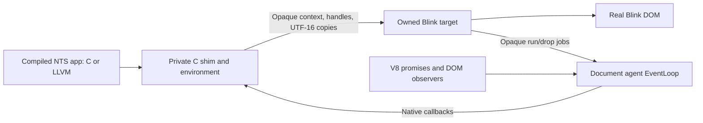

# Direct DOM and shared microtasks

This records the second experiment on 2026-10-05, using the source/toolchain
and available October 3 compiler recorded in [bring-up](bringup.md). React is
outside the current scope. This is an initial architecture experiment, with
no stable API or production performance claim.

## Result

Both C and LLVM application code create and mutate real Blink nodes directly.
The native HTML fixtures contain zero application scripts. Independently
executed V8 fixtures produce identical counter DOM, UTF-16 code units, and
complete mixed job/custom-element/MutationObserver traces.

The supported E2 subset passes. E3 has passing input, detached-node GC,
shared microtask, owned-host-task cancellation, and disposal witnesses;
general listeners/events, generated-await cancellation, task/timer posting,
rejection maintenance, cross-heap cycles, and multiple module instances remain
open. A failed compiler admission is not hidden by a TypeScript declaration.
See the [reduced contracts](contracts/README.md).

| Check | Result | Evidence under `target/chromium/` |
| --- | --- | --- |
| C direct DOM | Pass | `native-dom-c-smoke/result.json` |
| LLVM direct DOM | Pass | `native-dom-llvm-smoke/result.json` |
| V8 DOM oracle | Pass | `native-dom-oracle-smoke/result.json` |
| C shared microtasks | Pass | `native-microtasks-c-smoke/result.json` |
| LLVM shared microtasks | Pass | `native-microtasks-llvm-smoke/result.json` |
| V8 scheduling oracle | Pass | `native-microtasks-oracle-smoke/result.json` |
| Complete native/oracle comparison | Four comparisons pass | `comparison-result.json` |

Each native run receives ten input events, keeps a fresh counter for each
document, observes five attachments/four disposals across three reloads and
navigation away/back, and verifies browser survival after killing its selected
renderer. Renderers retain seccomp filtering, `NoNewPrivs`, and nested PID
namespaces. The shell's other sandbox and debug crash-path limitations remain
as recorded in bring-up.

## Boundary and semantics



The implementation uses an NTS-owned GN target staged at
`//third_party/blink/renderer/nts:dom_bridge`, with a small C-compatible public
entry point consumed by `//nts`. GN's Blink layering and header checks remain
enabled. Chromium's tracked source has no modifications. This target is
compiled against the pin's internal implementation; zero patches does not
make that implementation a stable upstream API.

The generated C/runtime, authored FFI shim and managed environment adapter
stay in C. The C++ bridge sees opaque contexts, 32-bit node identities,
length-bearing UTF-16 spans and opaque job callbacks. Blink and managed NTS
layouts do not cross into the other's C++ code. The same native archive is
linked by the standalone consumer and the renderer; standalone linking
discards unused DOM functions and supplies no fake DOM implementations.

The direct operations were checked against their IDL/generated binding paths
at the source pin: body access, query, element/text creation, append/remove,
text content, and attributes. Calls establish the document's main-world
`ScriptState`, use its actual agent queue, and enter custom-element reaction
scopes where the binding requires them. Queries and edits use real
`ExceptionState`, rather than a testing exception sink or a public helper that
collapses errors to null. Errors return as prototype status codes; NTS raises
and catches only after Blink returns, behind a native callback entry barrier.
This tests control-flow separation and legacy codes, not a full DOMException
class/name/message or arbitrary WebIDL conversion/overload surface.

The DOM program verifies canonical repeated queries, missing match versus
invalid selector, `SyntaxError` 12, `HierarchyRequestError` 3, `NotFoundError`
8, and `InvalidCharacterError` 5. It detaches a node, forces Blink GC, reads it
through its retained identity, reattaches it, and preserves that identity.
The registry uses a traced indexed node table and a traced hash map, avoiding
a linear identity lookup. Every bound node stays rooted until context
disposal; individual wrapper reclamation and cross-runtime cycle collection
are deliberately unresolved. Handles are scoped to their explicit context.

Strings copy on each boundary. NUL, Latin-1, non-Latin-1, paired and lone
surrogates round-trip through text and attributes. Inspection compares actual
Blink code units against V8, avoiding a self-consistent but corrupted native
round trip. `--js-flags=--expose-gc` permits the forced-GC test in both variants.
The separate available-compiler literal defect is recorded in the reductions.
Copied buffers and the TS helper are correctness prototypes, not optimized
string storage or a measured production binding path.

## Scheduling and lifetime

`NtsHost.enqueue_microtask` hands each native resume/completion to
`Document → ExecutionContext → Agent → EventLoop`. The bridge captures that
loop while the document is active: the document may have lost its execution
context when release notifications arrive. Queued callbacks use weak context
references, and context close drops owned state before destroying the NTS
environment. Shared agent-loop lifetime alone cannot identify document lifetime.

Each input invokes compiled code with two scalar awaits, then a C completion
calls the compiled counter increment and DOM update. The scalar parameter
isolates the available compiler's managed-argument capture failure. Three
native jobs per event mix with V8 promise jobs, including one nested V8 job.
Shared inspection code registers a V8 custom element and MutationObserver;
the identical instrumentation runs against both fixtures. Thus “zero
application scripts” does not mean V8 is absent from the semantic comparison.

The native callback uses a run-microtasks scope for cleanup after an actual
input callback; an enclosing script scope defers cleanup until script return.
Individual DOM calls use do-not-run scopes to avoid a checkpoint midway
through a compiled operation. This distinction is observable and matched V8:

| Delivery / listener order | Observed job order, first native index normalized to 1 |
| --- | --- |
| Actual input, native first | `native-1, native-2, native-3, v8-1, v8-nested` |
| Actual input, V8 first | `v8-1, v8-nested, native-1, native-2, native-3` |
| Script dispatch, native first | `native-1, v8-1, native-2, v8-nested, native-3` |
| Script dispatch, V8 first | `v8-1, native-1, v8-nested, native-2, native-3` |

Ten steps cover both listener orders, five platform input events and five
script dispatches. The comparator checks the complete CE/MO arrays, not just
the job labels. End-of-checkpoint collection leaves exactly one owned native
counter on every step. All four normal document disposals drop a separately
owned managed host task retaining that counter, release the counter, collect,
and assert zero live NTS objects before destroying the environment. This is
not proof that a pending generated await can be canceled: its null drop
callback remains an explicit blocker.

Normal Chromium dangling-pointer detection caught an envelope handoff bug
during development. The bridge now clears its tracked raw pointer before
invoking a C callback that consumes/frees the envelope. Pointer checks were
retained. Strong context guards and deferred environment disposal also bound
the synchronous call lifetime; arbitrary navigations from custom reactions
and general reentrant listeners still need separate acceptance fixtures.

## Reproduce

After the completed baseline, from the repository root:

```sh
node tooling/chromium/smoke.ts third_party/chromium/src/out/NtsBaseline/content_shell target/chromium/native-dom-oracle-smoke v8 dom
node tooling/chromium/smoke.ts third_party/chromium/src/out/NtsBaseline/content_shell target/chromium/native-microtasks-oracle-smoke v8 microtasks
node tooling/chromium/probe.ts c
node tooling/chromium/chromium.ts build --jobs 8
node tooling/chromium/smoke.ts third_party/chromium/src/out/NtsBaseline/nts_shell target/chromium/native-dom-c-smoke c dom
node tooling/chromium/smoke.ts third_party/chromium/src/out/NtsBaseline/nts_shell target/chromium/native-microtasks-c-smoke c microtasks
node tooling/chromium/probe.ts llvm
node tooling/chromium/chromium.ts build --jobs 8
node tooling/chromium/smoke.ts third_party/chromium/src/out/NtsBaseline/nts_shell target/chromium/native-dom-llvm-smoke llvm dom
node tooling/chromium/smoke.ts third_party/chromium/src/out/NtsBaseline/nts_shell target/chromium/native-microtasks-llvm-smoke llvm microtasks
node tooling/chromium/compare.ts
node runtime/chromium/experiments/contracts/check.ts
```

The engine is fully built; these native integration builds reuse it and took
under nine seconds with eight jobs on the initial host. The earlier OOM does
not justify raising concurrency automatically. Debug/component timing and
summed VmRSS do not establish application performance or distribution size.

## Next experiments

1. Agree host checkpoint-end maintenance and generated task cancellation with
   the runtime/compiler lanes, using the reductions. Test pending-state
   disposal at each suspension boundary and handled/unhandled rejections
   against V8 before widening the async profile.
2. Extend the event seam with typed event properties, callback identity,
   removal, capture/cancellation, nested dispatch and exceptions. Test custom
   reactions that synchronously detach/navigate while compiled code is active.
3. Add owner-thread task/timer posting with real cancellation and teardown
   ordering. Keep nested synchronous UI pumping unavailable.
4. Design a small typed source facade and lifetime policy around the proven
   operations. Resolve module instances and multiple documents before claiming
   ordinary app initialization or per-document global isolation.
5. Replace file opt-in with a browser-owned packaged origin, then measure a
   release profile against an equivalent V8 application, including cold/warm
   start, latency, allocation, CPU, PSS and complete runtime resources.

Keep operation semantics and ownership behind the narrow bridge; broader IDL
generation and product configuration follow evidence from these experiments.
