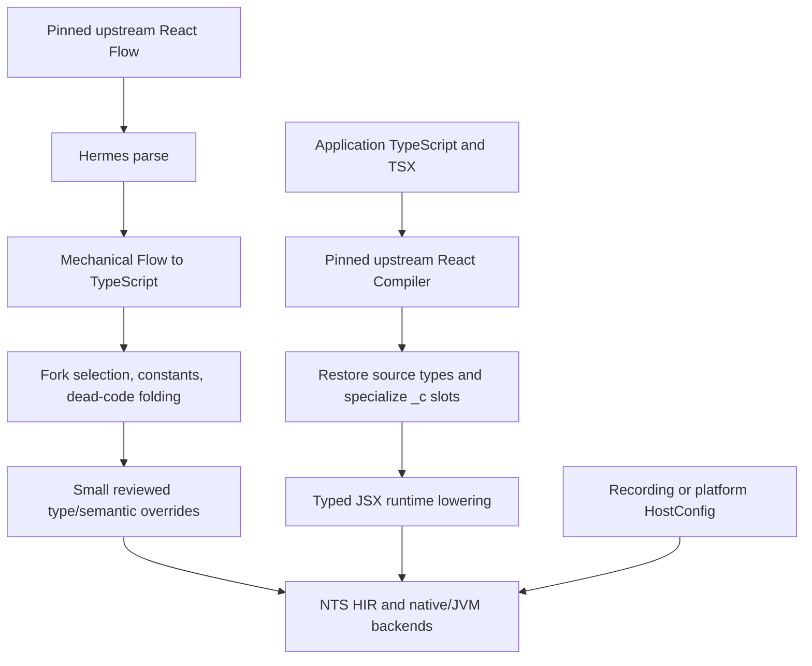

# Compiling React with NTS

## Decision

Keep upstream React and React Compiler as the source of truth. Build React
Compiler from the same pinned checkout, run it on application TS/TSX at build
time, and compile a mechanically generated profile of the upstream React
runtime with NTS. Maintain renderer code and small semantic overrides here;
do not maintain a handwritten React runtime fork.

This is the lowest-maintenance route that also gives React semantics a credible
oracle. A runtime rewritten in C could still benefit from React Compiler output
if it implemented the `_c` contract correctly, so the optimization is not tied
to React's implementation language. The problem with that route is the amount
of reconciler, scheduler, hook and error behavior we would own and continually
resynchronize.

## Two inputs, one linked program



React Compiler remains a build-time program running in the development
toolchain. Its output is ordinary control flow plus calls to
`react/compiler-runtime`. React itself, the selected reconciler, Scheduler,
the compiler-runtime contract and the platform HostConfig become native code.

## Upstream runtime generation

`upstream.lock.json` pins the exact React commit. The dependency analyzer starts
from profile entries, follows type and runtime edges, applies an explicit fork
map, hashes every input and records the virtual HostConfig surface. The current
production closure is 122 upstream files and 57,515 lines. The client profile
applies upstream's `ReactSharedInternalsClient` fork explicitly; omitting that
rule creates a real initialization cycle in a native-style bundle.

The generator uses React's Hermes parser and a pinned Flow-to-TypeScript
transform. Generated files are disposable and carry source provenance. The
baseline verifies 122/122 files parse as TypeScript and that stripping either
the original Flow or generated TypeScript yields identical runtime syntax.
Internal monorepo aliases are rewritten to their exact relative target.

Profile specialization happens after that equivalence check. It folds the
profile constants and records every transformed file hash. A separate link
specializer discovers 204 exported primitive constants, retains their imports
and module evaluation, replaces 2,448 reads and folds another 610 `if`
statements. This includes feature flags and lane numbers through one general
rule. Type corrections which cannot be generalized belong in
`overrides/manifest.json`, with a source hash and conformance case. Generated
output is never edited.

## Heterogeneous React values

NTS already has the right low-level shape: `Erased` values, `erase`, `tag.of`
and `unerase` in HIR. React does not need an unchecked JavaScript value or a
React-only object model. It needs a checked frontend contract over that shape:

```ts
interface TypeToken<Value> {
  readonly representation: symbol;
}

declare function pack<Value>(value: Value): ErasedValue;
declare function project<Value>(
  value: ErasedValue,
  token: TypeToken<Value>,
): Value | null;
```

These declarations describe compiler intrinsics, not ordinary allocating
functions. `pack` lowers to `erase`. `project` checks the runtime descriptor or
primitive tag and only then lowers to `unerase`. Ordinary TypeScript
refinements such as `typeof`, a React `$$typeof` discriminant or a proven Fiber
tag should produce the same proof without explicit calls.

The generated converter can use an internal `ReactValue` name for Flow
`mixed`/selected `any` sites, but HIR should use the general erased mechanism.
Every operation on it must be one of:

- carry, store, compare identity or forward without inspecting the payload;
- check a tag/descriptor and project to a static type; or
- enter a site the compiler has specialized from reaching-value evidence.

No generic property lookup, call, arithmetic operation or unchecked cast on an
erased value reaches HIR.

## Hooks and generics

Upstream React's hook list is heterogeneous. One node can hold state, the next
an effect, and the next a memo cache. `Hook<T>` cannot give that one linked list
a single useful `T`; using a generic there either lies about the list or still
stores an erased union.

The upstream-compatible representation therefore keeps the general Hook/Fiber
boundary erased and checked. Performance comes from specialization after the
component is known:

- `StateQueue<number>` and its reducer/update path are monomorphized;
- a component-specific hook frame gives each statically ordered hook a typed
  field;
- bailout, interruption and hot-reload paths can materialize or fall back to
  the upstream hook list without changing observable ordering;
- Fiber continues to point at arbitrary component state through an existential
  boundary.

The measured two-field hook grows from 32 to 56 bytes when both fields use the
current erased representation. Native optimization removes tag overhead in
simple stable loops, but typed frames still improve density and make the result
independent of backend optimizer quality.

## React Compiler cache

React Compiler emits `_c(N)` with a compile-time constant size and literal
indices. Treat this as a trusted intrinsic whose semantic implementation is
upstream `useMemoCache`, while its physical layout is selected by NTS.

The type-recovery pass uses the original checked component signature and the
types written to each index to produce a tuple such as:

```ts
const $ = _c<[
  number,
  () => void,
  string,
  () => void,
  number,
  JSX.Element,
]>(6);
```

The runtime cache is stable across renders and initializes slots with React's
sentinel. The sentinel is an internal state, not part of the application type:
React Compiler's dependency guard ensures an output slot is written before it
is read. NTS must preserve that control dependency. If a slot receives
incompatible representations, that slot alone falls back to erased storage.

This prototype restores compiler-synthesized component and outlined callback
parameters from source byte ranges, annotates evolving locals from their
reaching assignments, infers six Counter slots and passes a final strict check
with a generic `_c<T>` contract containing no explicit or inferred `any` in the
recovered sites. The recovered component executes in the pinned upstream
runtime and reaches NTS HIR; NTS then stops at the tracked JSX lowering gap.

## JSX and native hosts

React Compiler deliberately leaves JSX for a later transform. NTS should lower
JSX to the selected typed runtime (`jsx`, `jsxs`, `Fragment`) after React
Compiler and type recovery. Known intrinsic elements should use generated prop
records; `key`, `ref`, omission versus `undefined`, spread order and child order
must match React.

The reconciler stays platform-independent. Its HostConfig links to:

- the in-memory recording mutation host for deterministic conformance;
- a macOS/iOS adapter using generated typed native API bindings;
- an Android adapter using generated typed JVM/native API bindings; or
- later persistence/hydration profiles with their own explicit capabilities.

The recording host currently executes through NTS C with 15 checks. It uses one
uniform node layout and ordered typed props. A generated intrinsic-element
adapter must convert the React props boundary into that typed form.

The JavaScript oracle bundles the mechanically generated runtime from the same
pinned sources and redirects only HostConfig to a finite props projection. Its
eight scenarios cover function and class components, text and element mount,
keyed movement/deletion/insertion, state and reducer updates, context, layout
and passive effect order and cleanup, host/class refs, Suspense fallback,
unmounting, memo-cache ownership, and actual recovered React Compiler output.
The bundle reaches 100 source inputs; its recorded trees and ordered mutation
logs are the expected side of future C/LLVM/JVM comparisons.

## Performance gates

Correct output is required before a timing is reported. Each representative
mount, update, bailout, keyed reorder, context change, effect lifecycle,
Suspense transition and compiler-cache hit/miss scenario must produce the same
recording-host result and ordered log as upstream React.

For C/LLVM and JVM, measure:

- allocations and retained bytes per Fiber, Hook, update and React element;
- erased pack/project counts and failed checks;
- indirect component/host calls;
- cache-hit and cache-miss time for `_c` slots;
- mount, update and keyed-list reconciliation throughput;
- binary/class size and cold startup.

Compare the upstream-compatible erased form with typed component frames and
cache tuples. Keep specialization only when differential tests agree and the
generated backend output confirms that it removed representation work.

## Staged implementation plan

1. **Keep the selected runtime strict.** The normalized, profile-specialized
   and linked trees now have zero native TypeScript 7.0.2 diagnostics and zero
   audited escape hatches. Keep runtime-syntax equivalence and the exact-source
   JavaScript oracle green for every converter change and React upgrade.
2. **Close the measured NTS contracts.** Implement checked recursive union and
   intersection representation, valid implicit-undefined returns, the native
   Scheduler/host ABI, and the other reduced cases in `blockers/`. Then add
   configured typed JSX
   lowering and a trusted, descriptor-carrying `_c<Slots>` intrinsic. Expose
   checked descriptor projection for the remaining true existential
   boundaries. The local blocker directories define the required behavior and
   smallest reproductions.
3. **Run React itself through C.** Link the strict generated reconciler,
   compiler runtime and recording HostConfig. Compare native trees and ordered
   mutation/effect logs with all eight upstream scenarios, then add retry,
   interrupted concurrent work, transitions and error recovery.
4. **Enable specialization behind proofs.** Generate typed intrinsic props,
   component descriptors, hook frames, update queues and cache tuples. Keep
   erased storage per unresolved component or field. Accept each optimization
   only after differential and representation measurements pass.
5. **Reach backend parity.** Make the same linked program callable through LLVM
   and JVM, run the shared conformance/performance suite, and then replace the
   recording host with small iOS/macOS and Android HostConfig adapters.
6. **Turn the procedure into an upgrade gate.** A React update changes one pin
   and regenerates reports. Maintained handwritten code remains limited to
   profiles, host adapters, generalized transforms and exceptional overrides;
   the upstream runtime and compiler output remain disposable generated input.

## Upgrade workflow

1. Change the single React commit in `upstream.lock.json` and check out that
   commit in the read-only source repository.
2. Regenerate dependency, normalization, HostConfig-surface, profile and React
   Compiler golden reports.
3. Review closure, feature-flag, compiler-output and diagnostic diffs. A source
   hash mismatch cannot be silently accepted by an override.
4. Update generalized converter rules first. Add or change a small override
   only when the rule is source-specific and has a differential test.
5. Run recording-host differential conformance on JavaScript, C/LLVM and JVM.
6. Run the fixed performance suite and compare representation counts, code
   size and timings to the previous pinned commit.

An upgrade is acceptable when the selected upstream tests and local
differential cases pass, all backend omissions are explicit, and no regression
is hidden by new `any`, suppressions or trapping HostConfig calls.

## Current boundary

The production profile is strict ordinary TypeScript, but it is not yet an
end-to-end native React build. At the NTS revision recorded in
`reports/runtime-native-probe.json`, HIR refuses 941 constructs in 385
functions, fails verification in nine production-empty helpers and omits all
seven required public reconciler exports. Most refusals collapse to a few
shared roots: React key/node representation, object intersections, mutable
module function slots, structural methods, native host capabilities and the
JavaScript function/prototype surface. JSX lowering remains an explicit HIR
refusal. The current LLVM and JVM probes emit no callable exports for a fixture
C handles. Consequently, full reconciler allocation, packing, indirect-call
and throughput measurements are not yet meaningful. Current measurements cover
isolated object layout, tag operations, cache specialization and generated
backend size. Every limit has a local report or strict reproduction under
`blockers/`; this experiment does not edit NTS to hide one.
